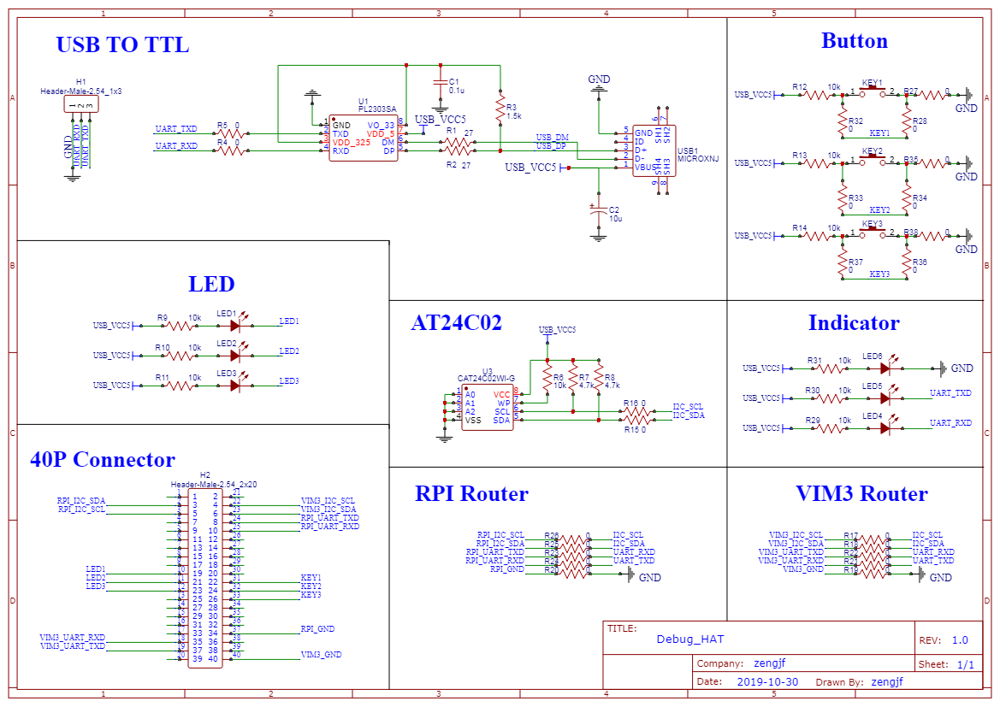
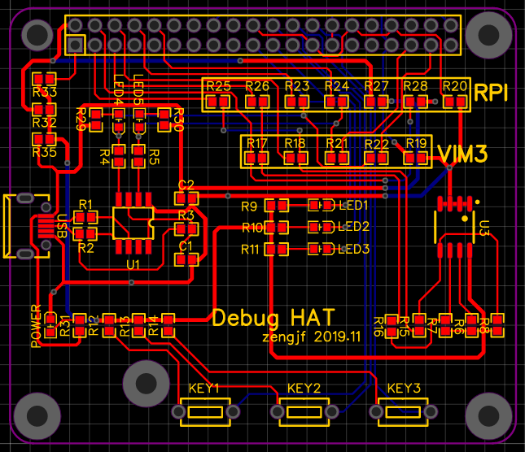

# README

主要是再处理树莓派和VIM3的时候发现他们的debug port（uart）是在40P的扩展口里，自己又不想每次带一个USB转TTL的模块，所以做了这个扩展板：
* PL2303SA；
* 3 * LED灯；
* 3 * 按键；
* 24C02 EEPROM；

**注意**： 
* 通过选择焊接`RPI`、`VIM3`两组电阻选择Raspberry Pi、Khadas VIM3主板；
* `R32`、`R33`、`R35`用于选择外围电路电源；

## Gerber File

[Gerber_Debug_HAT_20191101093810.zip](Gerber_Debug_HAT_20191101093810.zip)

## BOM

[BOM_DebugHAT_20191101112548.csv](BOM_DebugHAT_20191101112548.csv)

## Schematic

## PCB

  